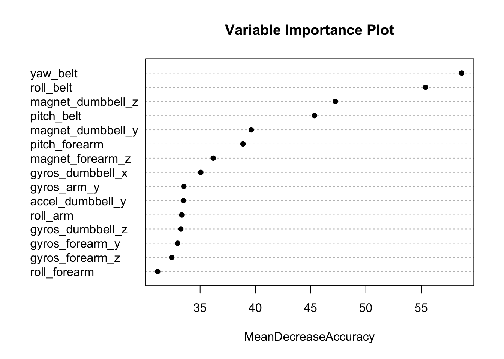

### Description 

In this project, the goal will be to use data from accelerometers on the belt, forearm, arm, and dumbell of 6 participants. They were asked to perform barbell lifts correctly and incorrectly in 5 different ways. 
The objective of the project is to predict the manner in which they did the exercise.

The training data for this project is available here: 

https://d396qusza40orc.cloudfront.net/predmachlearn/pml-training.csv

The test data is available here: 

https://d396qusza40orc.cloudfront.net/predmachlearn/pml-testing.csv

The data for this project is obtained from this source: http://groupware.les.inf.puc-rio.br/har. 

When you click the **Knit** button a document will be generated that includes both content as well as the output of any embedded R code chunks within the document. You can embed an R code chunk like this:

### Analysis

#### Download Data.

```r
url_train <- "https://d396qusza40orc.cloudfront.net/predmachlearn/pml-training.csv"

url_test <- "https://d396qusza40orc.cloudfront.net/predmachlearn/pml-testing.csv"

download.file(url = url_train, destfile = "pml-training.csv")

download.file(url = url_test, destfile = "pml-testing.csv")
```


### Getting and Cleaning Data


```r
pml_train <- read.csv("pml-training.csv", stringsAsFactors = FALSE, na.strings = c("", " "))

pml_test <- read.csv("pml-testing.csv", stringsAsFactors = FALSE, na.strings = c("", " "))
```

#### Peek at the data

```r
## Limiting the output for clarity
str(pml_train, list.len=10)
```

```
## 'data.frame':	19622 obs. of  160 variables:
##  $ X                       : int  1 2 3 4 5 6 7 8 9 10 ...
##  $ user_name               : chr  "carlitos" "carlitos" "carlitos" "carlitos" ...
##  $ raw_timestamp_part_1    : int  1323084231 1323084231 1323084231 1323084232 1323084232 1323084232 1323084232 1323084232 1323084232 1323084232 ...
##  $ raw_timestamp_part_2    : int  788290 808298 820366 120339 196328 304277 368296 440390 484323 484434 ...
##  $ cvtd_timestamp          : chr  "05/12/2011 11:23" "05/12/2011 11:23" "05/12/2011 11:23" "05/12/2011 11:23" ...
##  $ new_window              : chr  "no" "no" "no" "no" ...
##  $ num_window              : int  11 11 11 12 12 12 12 12 12 12 ...
##  $ roll_belt               : num  1.41 1.41 1.42 1.48 1.48 1.45 1.42 1.42 1.43 1.45 ...
##  $ pitch_belt              : num  8.07 8.07 8.07 8.05 8.07 8.06 8.09 8.13 8.16 8.17 ...
##  $ yaw_belt                : num  -94.4 -94.4 -94.4 -94.4 -94.4 -94.4 -94.4 -94.4 -94.4 -94.4 ...
##   [list output truncated]
```

```r
str(pml_test , list.len=10)
```

```
## 'data.frame':	20 obs. of  160 variables:
##  $ X                       : int  1 2 3 4 5 6 7 8 9 10 ...
##  $ user_name               : chr  "pedro" "jeremy" "jeremy" "adelmo" ...
##  $ raw_timestamp_part_1    : int  1323095002 1322673067 1322673075 1322832789 1322489635 1322673149 1322673128 1322673076 1323084240 1322837822 ...
##  $ raw_timestamp_part_2    : int  868349 778725 342967 560311 814776 510661 766645 54671 916313 384285 ...
##  $ cvtd_timestamp          : chr  "05/12/2011 14:23" "30/11/2011 17:11" "30/11/2011 17:11" "02/12/2011 13:33" ...
##  $ new_window              : chr  "no" "no" "no" "no" ...
##  $ num_window              : int  74 431 439 194 235 504 485 440 323 664 ...
##  $ roll_belt               : num  123 1.02 0.87 125 1.35 -5.92 1.2 0.43 0.93 114 ...
##  $ pitch_belt              : num  27 4.87 1.82 -41.6 3.33 1.59 4.44 4.15 6.72 22.4 ...
##  $ yaw_belt                : num  -4.75 -88.9 -88.5 162 -88.6 -87.7 -87.3 -88.5 -93.7 -13.1 ...
##   [list output truncated]
```

From the above we see that features 1-7 are metadata in Training dataset. In the Test dataset we have "Problem_id" in addition to above. So we'll remove those columns from the dataset.
The remainig features are all numeric, so it's good idea to explicitly convert these to numeric datatype, as some may not have converted automatically while reading.

#### Clean and Convert to Numeric

```r
# Remove metadata columns.
pml_train <- pml_train[,-c(1:7)]
pml_test <- pml_test[,-c(1:7,160)]

# convert all columns to Numeric except 'classe'
pml_train[,c(1:152)]<- sapply(pml_train[,c(1:152)],as.numeric)
pml_test[,c(1:152)]<- sapply(pml_test[,c(1:152)],as.numeric)
```

Next it's observed that there are several features with NA data. As the data has been gathered via sensors, imputing missing values will not yield correct results. Therefore it'd be appropriate to discard those features/columns.


```r
## identify NA columns
na.cols<- sapply(pml_train[,1:152], anyNA)
summary(na.cols)
```

```
##    Mode   FALSE    TRUE    NA's 
## logical      52     100       0
```

```r
#Filter NA columns
d_train<-pml_train[,!na.cols]
dim(d_train)
```

```
## [1] 19622    53
```

#### Split Data for cross validation.
Now we'll partition data for cross validation purpose.
For the purpose of this project we'll implement a 60/40 split based on the 'classe' variable. 


```r
# Load required packages

library(caret)
library(randomForest)
```


```r
# Split pml_train into Train and Test Set 

d<- createDataPartition(d_train$classe,p=.60, list=FALSE )

t_train <- d_train[d,]
t_test <- d_train[-d,]
```

#### Model Fit

We'll plan to build a model with 500 trees. Also to check variable importance, we'll set the flag TRUE.


```r
## Using Random Forest Algorithm

set.seed(2016)
d_fit <- randomForest(as.factor(classe)~., data = t_train, importance = TRUE, ntree=500)
```

#### Taking a look at the model 

```r
d_fit
```

```
## 
## Call:
##  randomForest(formula = as.factor(classe) ~ ., data = t_train,      importance = TRUE, ntree = 500) 
##                Type of random forest: classification
##                      Number of trees: 500
## No. of variables tried at each split: 7
## 
##         OOB estimate of  error rate: 0.58%
## Confusion matrix:
##      A    B    C    D    E  class.error
## A 3346    2    0    0    0 0.0005973716
## B    9 2263    7    0    0 0.0070206231
## C    0   12 2039    3    0 0.0073028238
## D    0    0   23 1906    1 0.0124352332
## E    0    0    2    9 2154 0.0050808314
```
From above it's observed that the Out-Of-Bag error rate is `0.51%`

#### Variable Importance Plot
Here lets observe which features were considered in the model and it's importance as given by Accuracy metric.

```r
varImpPlot(d_fit, sort = TRUE, n.var = 15 , main = "Variable Importance Plot", pch=16, type = 1)
```



#### Validating the model
Here we'll predict the `classe` outcome for out partitioned test data from the training set. 
This will confirmation if the model is a good fit or not.
Running the confusion matrix gives us the Accuracy, Sensitivity and Specificity of the predictions.


```r
pred_t_test <- predict(d_fit, t_test, type="class")
p<- data.frame(pred_t_test, stringsAsFactors = FALSE)
confusionMatrix(t_test$classe, p$pred_t_test)
```

```
## Confusion Matrix and Statistics
## 
##           Reference
## Prediction    A    B    C    D    E
##          A 2227    1    0    0    4
##          B   17 1496    5    0    0
##          C    0   13 1354    1    0
##          D    0    0    5 1279    2
##          E    0    0    0    1 1441
## 
## Overall Statistics
##                                           
##                Accuracy : 0.9938          
##                  95% CI : (0.9918, 0.9954)
##     No Information Rate : 0.286           
##     P-Value [Acc > NIR] : < 2.2e-16       
##                                           
##                   Kappa : 0.9921          
##  Mcnemar's Test P-Value : NA              
## 
## Statistics by Class:
## 
##                      Class: A Class: B Class: C Class: D Class: E
## Sensitivity            0.9924   0.9907   0.9927   0.9984   0.9959
## Specificity            0.9991   0.9965   0.9978   0.9989   0.9998
## Pos Pred Value         0.9978   0.9855   0.9898   0.9946   0.9993
## Neg Pred Value         0.9970   0.9978   0.9985   0.9997   0.9991
## Prevalence             0.2860   0.1925   0.1738   0.1633   0.1844
## Detection Rate         0.2838   0.1907   0.1726   0.1630   0.1837
## Detection Prevalence   0.2845   0.1935   0.1744   0.1639   0.1838
## Balanced Accuracy      0.9958   0.9936   0.9953   0.9987   0.9978
```
From above metrics, it appears that our model Accuracy of 99.3%.
This is a very confident measure, so now we can run the test dataset on this model for prediction.

#### Predicting on the given test dataset.

```r
pred_pml_test <- predict(d_fit, pml_test, type="class")
pred_pml_test
```

```
##  1  2  3  4  5  6  7  8  9 10 11 12 13 14 15 16 17 18 19 20 
##  B  A  B  A  A  E  D  B  A  A  B  C  B  A  E  E  A  B  B  B 
## Levels: A B C D E
```

#### Generate Prediction Submission Files

```r
pml_write_files = function(x){
  n = length(x)
  for(i in 1:n){
    filename = paste0("problem_id_",i,".txt")
    write.table(x[i],file=filename,quote=FALSE,row.names=FALSE,col.names=FALSE)
  }
}

# Run the function to generate the submission files.
pml_write_files(pred_pml_test)
```

## Summary

The estimated error rate of our model is quite low 0.7% and the cross validation Accuracy is 99%. We can conclude that the predictions on Test Dataset will be quite accurate.


```
##  1  2  3  4  5  6  7  8  9 10 11 12 13 14 15 16 17 18 19 20 
##  B  A  B  A  A  E  D  B  A  A  B  C  B  A  E  E  A  B  B  B 
## Levels: A B C D E
```


